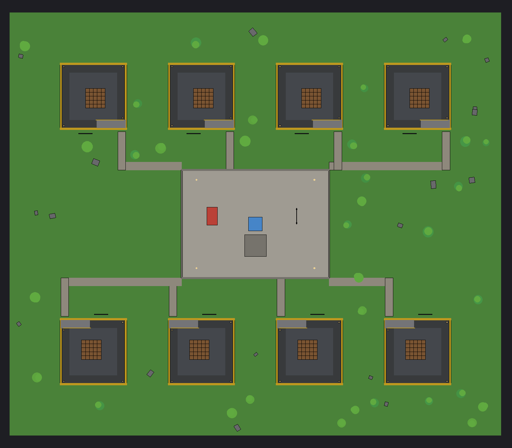

# 🌩 Симулятор Бункера (Roblox)

Игра в стиле «Build a Boat for Treasure», только про бункер: строишь бункер из блоков
(в том числе **под землёй** — участок можно копать на 3 слоя вглубь), заходишь внутрь,
нажимаешь **СТАРТ**, и на твой участок обрушивается шторм: **град**, **ураган**,
**метеоритный дождь**, **кислотный дождь** и **землетрясение**. Если кислоты накопится слишком много,
а бункер недостаточно прочный, она начнёт **просачиваться через дверь** и затапливать бункер.



## Как открыть

1. Скачай файл **`BunkerSimulator.rbxl`** из корня репозитория.
2. Открой его в **Roblox Studio** (File → Open from File).
3. Нажми **Play** (F5). Карта видна и без запуска — её можно посмотреть в редакторе.

> **Для теста в Studio** новый игрок получает 5000 монет, чтобы сразу проверить магазин
> и готовые бункеры (в опубликованной игре — 100). Меняется в `src/shared/Config.luau`
> (`StudioStartingCoins`).
>
> Сохранения работают только в опубликованной игре. В неопубликованном файле игра
> автоматически работает **без сохранений** (это нормально, ошибок не будет).
> Чтобы включить сохранения: опубликуй место (File → Publish to Roblox) и включи
> *Game Settings → Security → Enable Studio Access to API Services*.

## Как играть

1. **Обучение** проведёт по шагам: открыть магазин → забрать бесплатную «Стартовую хижину» →
   закрыть магазин → узнать про кнопку «Строить».
2. Потом **жёлтая стрелка** приведёт к твоему участку-котловану (спуск по пандусу).
3. Подойди к двери — она откроется только для тебя. Зайди внутрь.
4. Нажми **▶ НАЧАТЬ ШТОРМ**.
5. Фазы шторма: подготовка (5 с) → град (30 с) → [ураган 18 с] → [метеориты 15 с] → затишье (4 с) →
   кислотный дождь (50 с) → [землетрясение 14 с] → шторм уходит.
   Бедствия в скобках выбираются случайно: на 1–3 уровне одно, с 4-го два, с 7-го все три.
6. Выжил — получаешь монеты и следующий уровень шторма. Бункер после шторма
   восстанавливается сам.

### Управление

| Действие | ПК | Телефон |
|---|---|---|
| Режим строительства | `B` или кнопка 🔨 | кнопка 🔨 |
| Поставить блок | ЛКМ (можно вести мышью) | тап по клетке, затем второй тап или «✔ Поставить» |
| Повернуть | `R` (двери сами разворачиваются вдоль стены) | «🔄 Повернуть» |
| Удаление / копать землю | `X` | «🗑 Удаление» |
| Выйти из строительства | `Q` / `B` | «✖ Выйти» |
| Магазин | кнопка 🛒 или киоск в лобби (`E`) | кнопка 🛒 / киоск |

## Механики

- **Град** бьёт по верхним блокам. Под открытым небом ранит игрока; под тонкой крышей
  часть удара достаётся игроку (дерево/стекло передают больше, титан — ничего).
- **Кислотный дождь** разъедает верхние блоки. **Металл и сталь разъедаются сильнее**,
  бетон и камень — устойчивы, стекло кислоте не поддаётся.
- **Ураган** дует с одной стороны и ломает стены, открытые ветру (дерево и стекло — сильнее всего).
  Игрока на улице ранит. Под землёй и в бункере безопасно.
- **Метеориты** летят прямо в постройку: пробивают крышу и пару блоков под ней, задевают соседние.
  Землю не пробивают — подземный бункер под толстой крышей самый надёжный.
- **Землетрясение** трясёт все постройки: чем выше блок, тем сильнее урон. Подземные блоки почти не страдают.
  Лужа в это время медленно уходит, но продолжает затекать в бункер.
- **Под землёй**: в режиме удаления кликай по земле, чтобы копать (бесплатно, землю нельзя разрушить штормом).
  Выкопанная яма без крыши — это улица (туда затекает кислота), под крышей — часть бункера.
- **Лужа кислоты** поднимается в котловане и разъедает затопленные стены снаружи.
- **Дверь** держит определённую высоту кислоты (деревянная 3.5 ст., железная 7, гермодверь 13.5).
  Если кислоты больше — она **просачивается через дверь** (видно струю у двери, бункер затапливает).
- **Пробоина** в стене ниже уровня кислоты — бункер быстро заливает.
  **Дыра в крыше** — внутрь капает дождь.
- Внутри урон начинается, когда кислоты становится по колено.

### Баланс (симуляция, игрок в центре бункера)

Бедствия стали заметно агрессивнее: готовые бункеры держатся меньше, чем раньше, — их стоит
усиливать (гермодверь, толстая крыша, подземный этаж).

| Бункер | Цена | Держится до уровня |
|---|---|---|
| Стартовая хижина (дерево, деревянная дверь) | бесплатно | 1 |
| Каменный / металлический / бетонный (железная дверь) | 715 / 1514 / 2718 | 3–4 |
| Стальная крепость | 8670 | 17 |
| Титановое убежище | 36788 | 18+ |

Награда за уровень: 115 монет на 1-м, 255 на 5-м, 430 на 10-м (меньше, если бункер сильно повреждён;
при поражении — часть награды за пройденное время).

## Где что менять

- **Баланс, цены, блоки, урон шторма** — `src/shared/Config.luau`
- **Готовые бункеры** — `src/shared/Prefabs.luau`
- **Звуки (ID)** — `src/client/Controllers/Sounds.luau`
- **Карта** — генерируется скриптом `tools/gen_map.luau`

В Studio все скрипты лежат в `ServerScriptService/Server`, `ReplicatedStorage/Shared`,
`StarterPlayer/StarterPlayerScripts/Client`.

## Что проверено

Roblox нельзя запустить вне Studio, поэтому качество проверялось так:

- **Строгий статический анализ** всего кода (`luau-lsp`, `--!strict`, типы Roblox API) — 0 ошибок.
- **Проверка имён свойств** всех UI-элементов по базе Roblox API.
- **28 юнит-тестов** логики: сетка, затопление, протечки дверей, сериализация, готовые бункеры,
  подземные комнаты, ураган, метеориты, землетрясение.
- **Симуляция баланса**: каждый готовый бункер против штормов 1–18 уровня со всеми бедствиями
  (та же логика, что на сервере).
- **Проверка собранного места**: структура, события, участки, отсутствие устаревших API.
- **Три раунда ревью** (сервер, клиент, сценарий игрока, геометрия, производительность) с перепроверкой каждой находки.

## Сборка из исходников (для разработчиков)

```bash
tools/setup.sh   # скачать Rojo, Lune, luau-lsp в .tools/
tools/build.sh   # карта -> тесты -> строгий анализ типов -> BunkerSimulator.rbxl -> проверка места
```

Проверки: `luau-lsp` в строгом режиме с типами Roblox API, юнит-тесты логики сетки/шторма
и симуляция баланса (`.tools/lune run tools/tests/balance.luau`).

## Оптимизация под телефон и ПК

- Весь урон считает сервер по данным сетки (без физики и лучей на каждую градину).
- Все эффекты (град, дождь, кислота, освещение) рисует клиент; град — пул деталей + `BulkMoveTo`.
- Плотность эффектов снижается на слабых устройствах (качество графики и FPS).
- Интерфейс масштабируется под экран, кнопки на телефоне не перекрывают джойстик.
- Карта ~400 деталей, все закреплены (`Anchored`), декор без коллизий и запросов.
- Земля под участком: детали создаются только для видимых клеток (верхний слой и стенки выкопанных ям).
